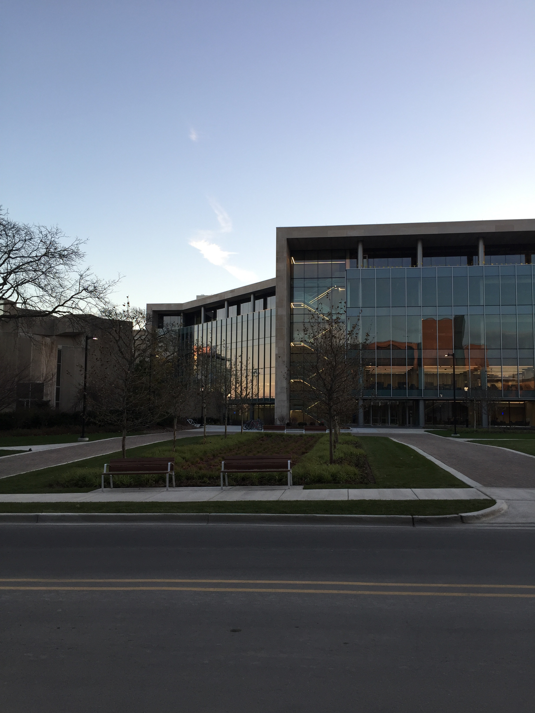
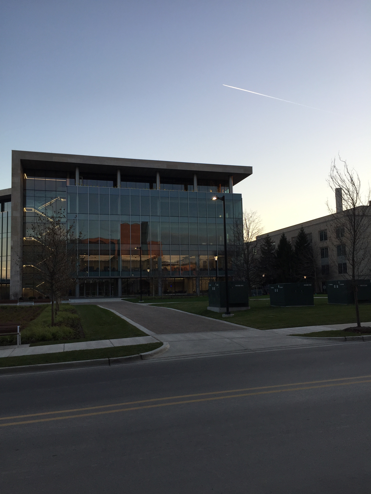
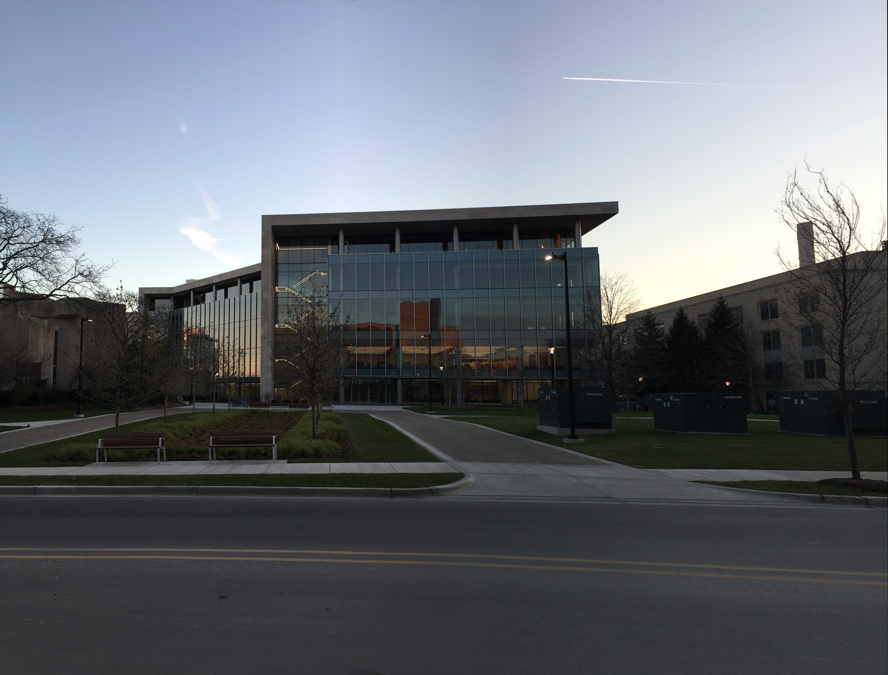
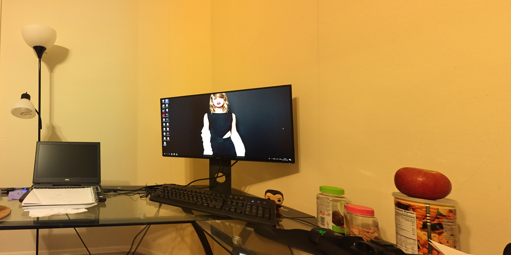

# Image Stitching Graduation Project

This repository presents a graduation project on automatic image stitching using
classical computer vision methods. The goal is to combine two overlapping images
into a wider panorama by detecting local features, estimating a homography, and
blending the aligned images.

The project is organized as a portfolio-ready version of the graduation work.
It keeps the implementation compact while documenting the algorithmic pipeline
clearly.

## Project Background

Image stitching is a common computer vision task used in panorama generation,
mapping, robotics, and visual inspection. Given two images with overlapping
fields of view, the system estimates the geometric relationship between them and
warps one image into the coordinate space of the other.

This project implements a feature-based stitching pipeline using:

- SIFT feature extraction
- K-nearest-neighbor feature matching
- Lowe's ratio test for match filtering
- RANSAC-based homography estimation
- Perspective warping
- Weighted mask blending

## My Role

- Implemented and studied the image stitching pipeline as a graduation project.
- Built the feature extraction, matching, homography, warping, and blending
  workflow in Python/OpenCV.
- Tested the algorithm on multiple image pairs and reviewed failure cases where
  overlap or feature quality was insufficient.
- Organized the repository for public presentation with clearer documentation
  and reproducible usage instructions.

## Algorithm Pipeline

```text
Input image pair
      |
      v
SIFT keypoint detection and descriptor extraction
      |
      v
KNN descriptor matching
      |
      v
Ratio-test filtering
      |
      v
RANSAC homography estimation
      |
      v
Perspective transform / image warping
      |
      v
Weighted blending
      |
      v
Panorama output
```

## Repository Structure

```text
.
├── Image_Stitching.py      # Main stitching implementation
├── images/                 # Example input and output images
├── requirements.txt        # Minimal Python dependencies
└── README.md
```

## Setup

Install dependencies:

```bash
pip install -r requirements.txt
```

For OpenCV versions where SIFT is provided through the contrib package,
`opencv-contrib-python` is required.

## Usage

```bash
python Image_Stitching.py images/q11.jpg images/q22.jpg
```

The script writes:

- `matching.jpg`: feature matching visualization
- `panorama.jpg`: final stitched panorama

## Sample Results

Input images:

 

Feature matching:


Panorama output:



Additional examples:




## Limitations

- The method works best when two images have sufficient overlap.
- Low-texture scenes, repeated patterns, motion blur, or strong viewpoint
  differences can reduce matching quality.
- The blending method is simple and may leave visible seams in difficult cases.
- The implementation focuses on understanding the classical pipeline rather
  than production-grade panorama generation.

## Public Repository Notes

This repository is based on the open-source project
[linrl3/Image-Stitching-OpenCV](https://github.com/linrl3/Image-Stitching-OpenCV)
and was organized as a graduation-project portfolio. The public version focuses
on the learning outcome, algorithmic workflow, and reproducible examples.
